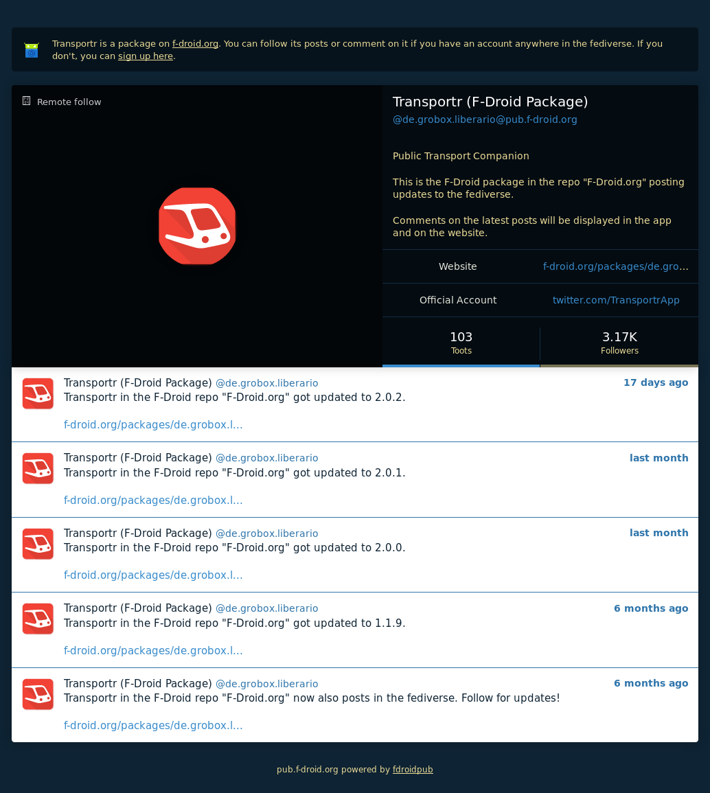
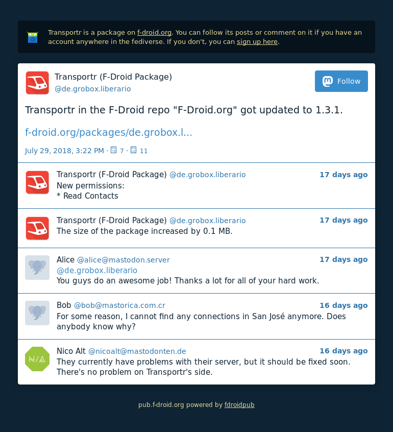
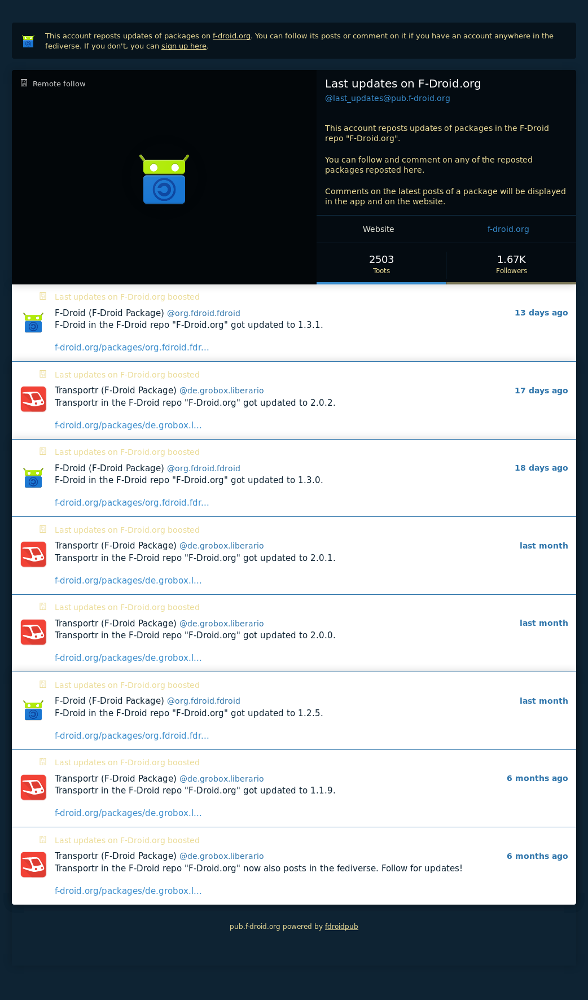

# fdroidpub

*This is still only an idea and not yet implemented nor deployed.
Please open issues in this repo or comment on
[the dedicated topic in the forum](https://forum.f-droid.org/t/3553) for discussing it.*

Makes [F-Droid](https://f-droid.org) repositories accessible on the
[fediverse](https://en.wikipedia.org/wiki/Fediverse) by publishing events
like new and updated packages as posts under packages' accounts.
By using the comments of packages' latest posts on the website and in the client,
this makes packages commentable and produces opt-in statistics about
the popularity of an package with indicators like the amount of following users.

## Features

* Based on [Python](https://www.python.org/) and [Django](https://www.djangoproject.com/),
*fdroidpub* shares code with [Repomaker](https://f-droid.org/repomaker/)
and [F-Droid itself](https://gitlab.com/fdroid/fdroidserver)
* Account IDs based on apps' package name (e.g. *@org.fdroid.fdroid@pub.f-droid.org*)
* Posts get published as Atom feeds (e.g. */@org.fdroid.fdroid/posts.atom*)
* Post ID is version code (e.g. */@org.fdroid.fdroid/1003051*)
* Comments to posts get published as Atom and JSON feeds (e.g. */@org.fdroid.fdroid/1003051/comments.json*)
* Permanent link to latest comments (e.g. */@org.fdroid.fdroid/latest_comments.json*)
* Administration through Django's Admin UI
* Special accounts *last_updated*, *latest* and *status*
* *last_updated* reposts packages' posts
* *latest* reposts packages' first posts (*... got newly published*)
* *status* posts statistics (*Just now 3 new packages got added*,
*Some moments ago 24 packages got updated*, *The most used permission in
this repo is android.permission.INTERNET*)
* Easy domain and user blocking
* Authorized users can delete comments and block users by replying to them (e.g. */fdroidpub block*)
* Everything gets posted "unlisted" by default

## Should feature later

* Internationalization through subdomains (e.g. *es.pub.f-droid.org*)
* ~~Alternatively: i18n through suffixes (e.g. @org.fdroid.fdroid.es)~~
Bad because of potential duplications and mixed languages
* Easily deployable with Docker
* Users can sign up directly for commenting, following etc.
* Users can comment from inside the app and the website
* Own proper administration UI
* Built-in Let's Encrypt support

## Mockups

## Stages to production

For this section, issues should be created and attached to proper milestones.

### Stage 0

* Clone repo and save in local database (like Repomaker)
* Create first posts of packages
* Display posts on web page

### Stage 1

* Serve posts read-only over ActivityPub
* Check with local Mastodon instance

### Stage 2

* Implement comments through ActivityPub
* Check with local Mastodon instance

### Stage 3

* Generate Atom and JSON feeds for everything

### Stage 4

* Implement special accounts *last_updated*, *latest* and *status*
